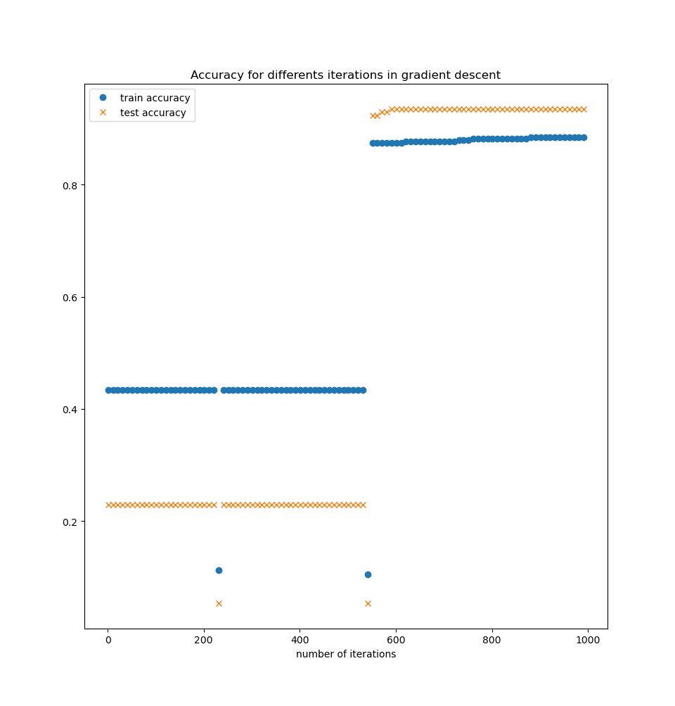

\newpage

# Introduction

The linear discriminant analysis is a method used to classify or to make a dimensional reduction on data thanks to a linear method.
There are multiple ways to implement this method.
So in this work, we want to implement 2 ways to implement the LDA method: the Raleigh method and the Gradient Descent method.

# Methodology

The Linear Discriminant method is a way to classify two classes $c_1$ and $c_2$:

We have $h$ classes and we want to class some datas in theses classes thanks to a set of features.
To do that, we want to find an optimal transformation to map all the elements of the classes on an hyperplane, and separe then thanks to a threshold which split the classes.

So we have a dataset $X$ of dimensions $(n, d)$ ($n$: number of lines, $d$: number of features)

We want to find an optimal $w$ (of dimension $(d, h - 1)$, with $h = \text{number of classes}$) to map all the datas on a hyperplane. The $w$ is optimal if the classes are well separated.

To map the datas on the hyperplane, we apply $X \cdot w$, and then we have only a dataset of dimension $n, h - 1$.

And then, we just have to find a threshold to separe classes.

So we want to find an optimal $w$ to map our dataset.

We note $\bar{x}$ the data $x$ projected, $\bar{\mu_i}$ the mean of all the projected elements of the class $i$ and $N_i$ the number of elements in the class $i$.
We note $\bar{\mu}$ the mean overall and $\mu_i$ the mean of the class $i$. 

We want to maximise the distance between each mean of classes and the overall mean of the datas, and we want that if a class is small, it influences a few the result whereas if a class is with a lot of datas, it influences a lot the result.
So we have: (note that the $N_i$ here allow us to give more importance to classes with more items)

\begin{align}
\sum_i^{h} N_i(\bar{\mu_i} - \bar{\mu})^2
&= \sum_i^{h} N_i \left(\frac{1}{n_i}\sum_{x \in c_i} w^Tx - \frac{1}{n}\sum w^Ty \right)^2 \\
&= \sum_i^{h} N_i \left(w^T\mu_i - w^T\mu \right)^2 \\
&= \sum_i^{h} N_i \left(w^T(\mu_i -\mu) \right)^2 \\
&= \sum_i^{h} N_i \left(w^T(\mu_i -\mu)(\mu_i -\mu)^Tw\right) \\
&= w^T\left(\sum_i^{h}N_i(\mu_i -\mu)(\mu_i -\mu)^T\right)w \\
&= w^TS_Bw \\
\end{align}

$S_B$ is called the between class scatter matrix.

But we want that the variance of each classes is not too big, to avoid overlaps of the classes.

So we want that:

\begin{align}
\sum_i^{h} \sum_{x \in c_i} \left( \bar{x} - \bar{\mu_i}\right)^2
&=\sum_i^{h} \sum_{x \in c_i} \left( w^Tx - w^T\mu_i\right)^2 \\
&= \sum_i^{h} \sum_{x \in c_i} \left( w^T(x - \mu_i)\right)^2 \\
&= \sum_i^{h} \sum_{x \in c_i} w^T(x - \mu_i)(x - \mu_i)^T w \\
&= w^T \left(\sum_i^{h} \sum_{x \in c_i}(x - \mu_i)(x - \mu_i)^T \right) w \\
&= w^T S_w w \\
\end{align}

$S_w$ is called the within class scatter matrix.

So we want to find a $w$ that minimise the within class and maximise the between class.

That's why we define the Fisher linear discriminant $J(w) = \frac{|w^T S_B w|}{|w^T S_w w|}$
and we want to find a $w$ that maximise this Fisher linear discriminant.

As we want to find the $w$ which maximise the Fisher linear discriminant, we can define $\hat{J} = J^{-1} = \frac{|w^T S_w w|}{|w^T S_B w|}$. And then, as it's a minimisation problem, we can use the gradient descent, so we have $w^{j + 1} = w^{j} - \alpha \frac{\partial \hat{J}}{\partial w}$.

The gradient of $\hat{J}$ is given by:

$$\frac{\partial \hat{J}}{\partial w} = 2\hat{J}(w) [ S_w w (w^TS_w w)^{-1} - S_B w (w^T S_B w)^{-1}]$$


## LDA vs PCA

The main difference between LDA and PCA is that LDA is a supervised method, whereas PCA is an unsupervised method:
PCA just search the principal axis that maximise the variance, whereas LDA search the axes that maximise the distance between classes.

So LDA is more usefull in case we have multiple classes.

But LDA has the asumption that the datas follow a normal distribution, so if we know the distribution of datas, we would use LDA if the datas have a normal distribution and PCA if the datas have other distribution. For instance, if we work with images, the distribution is not a normal distribution, so we would prefer using PCA.

However, we commonly use PCA with LDA for dimensional reduction.

\newpage

# Results

## Gradient descent iterations

I try the gradient descent method for multiple iterations (from 1000 to 10000) with the binary dataset cancer, and I have obtained the following graphic:




On the plot, we can see that for a relatively small number of iterations, we have a bad accuracy, and then, when the number of iterations increase, the accuracy becomes better.
And after, the accuracy stay constant.

So it means that for a small number of iterations, the gradient descent has not enought iterations to have good results since the method will oscillate far from the optimal $w$, and for a too big number of iterations, the result doesn't become better since the method oscillate near from the optimal $w$.
To have a more optimal $w$, we can play with the learning rate to have a smaller step, which allow us to oscillate even more closely.

So for the gradient descent, it's an optimization problem to find the right learning rate and the right number of iterations to find an optimal solution.

Here is an example of the results obtained with the learning rate equals to 1 and with the learning rate equals to 0.1 to show that the learning rate plays an important role in the computation of $w$:

```text
Learning rate = 1
LDA_GD train accuracy: 0.43358395989974935
LDA_GD test accuracy: 0.22941176470588234
Learning rate = 0.1
LDA_GD train accuracy: 0.8847117794486216
LDA_GD test accuracy: 0.9352941176470588

```

We can see that for the learning rate = 1, we can't have results as good as with a smaller learning rate, since the method oscillate further away from the optimal $w$.

## Gradient descent VS Raleigh

When we see the accuracy of the two methods on the test dataset, we can see that we have a test accuracy greater for the gradient descent than for the raleigh method.

In one case, we compute directly $w$, and in the other case, we try to optimise the $w$ thanks to a gradient descent.
One advantage and one disavantage of the gradient descent is that this method is parametrizable: we can choose the learning rate and the number of iterations, which allow us to be near an optimal solution, but it means that we have to right fix the number of iterations and the learning rate. So this method can be more efficient in some cases, but can be also less efficient if we chose bad number of iterations or learning rate.

On the contrary, the raleigh method is not parametrizable. The results are less good than the gradient descent, but we don't need to find the optimal parameters to find a solution, so we would always have good results, but not excellent results as with the gradient descent method.

So the gradient descent and the raleigh method are very good, as we can see below, but the gradient descent has an advantage compared to the raleigh method: the gradient descent is parametrizable.

\newpage

# Conclusion

So the linear discriminant analysis has multiple way to be implemented, and we see the implementation of LDA with the gradient descent method and with the raleigh method.

The gradient descent has the advantage to find a more optimal solution, compared to the raleigh method, but to find this solution, we have to optimize the number of iterations and the learning rate of the gradient descent method, whereas the raleigh method give us a good result (not an excellent result...), but don't need to optimize parameters.

In case of dimensional reduction, we commonly use LDA with PCA. Else, we can use LDA if the datas follow a normal distribution (since the LDA method have the asumption that the distributions are normal)
